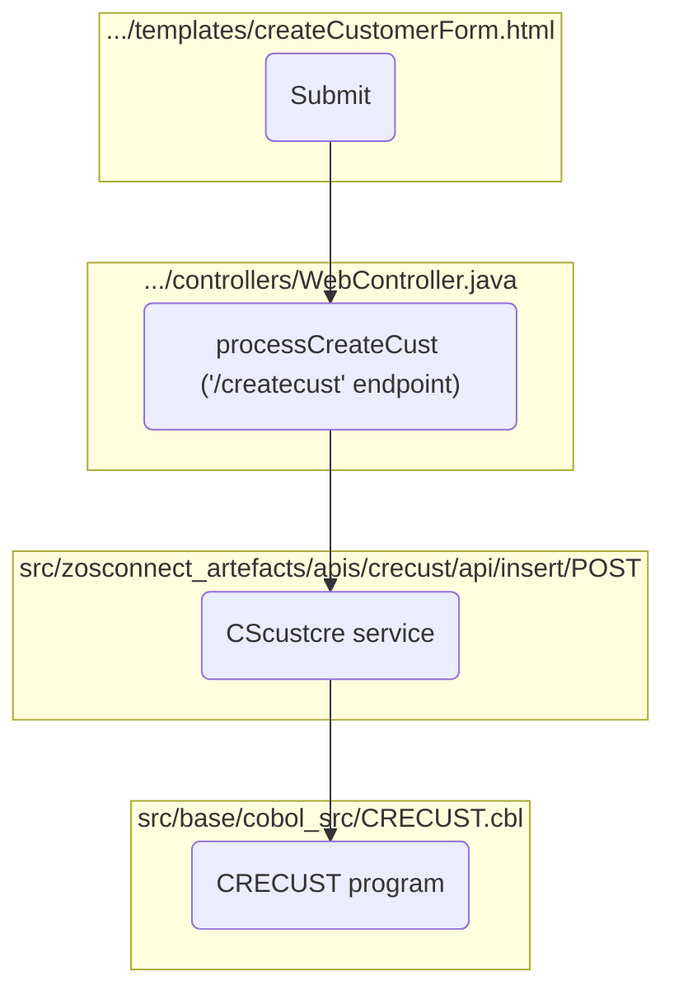

The process of creating a customer begins with submitting the form found at <SwmPath>[src/Z-OS-Connect-Customer-Services-Interface/src/main/resources/templates/createCustomerForm.html](/src/Z-OS-Connect-Customer-Services-Interface/src/main/resources/templates/createCustomerForm.html)</SwmPath> in the customer services user interface and ends with saving the customer data in the backend.

&nbsp;



## Customer creation form

<SwmSnippet path="/src/Z-OS-Connect-Customer-Services-Interface/src/main/resources/templates/createCustomerForm.html" line="25">

---

This is the customer creation form in customer services interface. When the form is submitted, the data is sent to the <SwmToken path="/src/Z-OS-Connect-Customer-Services-Interface/src/main/java/com/ibm/cics/cip/bank/springboot/customerservices/controllers/WebController.java" pos="490:5:6" line-data="	@PostMapping(&quot;/createcust&quot;)">`/createcust`</SwmToken> endpoint.

```html
            <form class="bx--form-item form" action="/createcust" th:action="@{/createcust}"
                th:object="${createCustomerForm}" method="post">
                <table>
                    <tr>
                        <td>
                            <h1>Create Customer</h1>
                        </td>
                    </tr>
                    <tr>
                        <td>Customer Name:</td>
                        <td><input class="bx--text-input" type="text" th:field="*{custName}" /></td>
                        <td class="danger" th:if="${#fields.hasErrors('custName')}" th:errors="*{custName}">Customer
                            Name Error</td>
                    </tr>
                    <tr>
                        <td>Customer Address:</td>
                        <td><input class="bx--text-input" type="text" th:field="*{custAddress}" /></td>
                        <td class="danger" th:if="${#fields.hasErrors('custAddress')}" th:errors="*{custAddress}">
                            Customer
                            Address Error</td>
                    </tr>
                    <tr>
                        <td>Customer Date of Birth</td>
                        <td><input class="bx--date-picker" type="date" th:field="*{custDob}" /></td>
                        <td class="danger" th:if="${#fields.hasErrors('custDob')}" th:errors="*{custDob}">Date of Birth
                            error</td>
                    </tr>
                    <tr>
                        <td><button class="bx--btn bx--btn--primary" type="submit">Submit</button></td>
                    </tr>
                </table>
            </form>
```

---

</SwmSnippet>

## <SwmToken path="/src/Z-OS-Connect-Customer-Services-Interface/src/main/java/com/ibm/cics/cip/bank/springboot/customerservices/controllers/WebController.java" pos="490:5:6" line-data="	@PostMapping(&quot;/createcust&quot;)">`/createcust`</SwmToken> endpoint.&nbsp;

<SwmSnippet path="/src/Z-OS-Connect-Customer-Services-Interface/src/main/java/com/ibm/cics/cip/bank/springboot/customerservices/controllers/WebController.java" line="490">

---

The <SwmToken path="/src/Z-OS-Connect-Customer-Services-Interface/src/main/java/com/ibm/cics/cip/bank/springboot/customerservices/controllers/WebController.java" pos="491:5:5" line-data="	public String processCreateCust(@Valid CreateCustomerForm createCustForm,">`processCreateCust`</SwmToken> is a controller method in the Spring Boot application that handles the creation of a new customer.

```java
	@PostMapping("/createcust")
	public String processCreateCust(@Valid CreateCustomerForm createCustForm,
			BindingResult bindingResult, Model model)
			throws JsonProcessingException
	{
		if (bindingResult.hasErrors())
		{
			return CREATE_CUSTOMER_FORM;
		}
```

---

</SwmSnippet>

<SwmSnippet path="/src/Z-OS-Connect-Customer-Services-Interface/src/main/java/com/ibm/cics/cip/bank/springboot/customerservices/controllers/WebController.java" line="508">

---

<SwmToken path="/src/Z-OS-Connect-Customer-Services-Interface/src/main/java/com/ibm/cics/cip/bank/springboot/customerservices/controllers/WebController.java" pos="491:5:5" line-data="	public String processCreateCust(@Valid CreateCustomerForm createCustForm,">`processCreateCust`</SwmToken>  receives the form data object, validates it, serializes it to JSON, sends it in a POST request to the <SwmPath>[src/zosconnect_artefacts/apis/creacc/api/insert/](/src/zosconnect_artefacts/apis/creacc/api/insert/)</SwmPath> endpoint.

```java
		// The port is set elsewhere as it changes frequently
		WebClient client = WebClient
				.create(ConnectionInfo.getAddressAndPort() + "/crecust/insert");

		try
		{
			// Create a response object - body of json, accept json back, and
			// insert the
			// request body created a couple lines up
			ResponseSpec response = client.post()
					.header(CONTENT_TYPE, APPLICATION_JSON)
					.accept(MediaType.APPLICATION_JSON)
					.body(BodyInserters.fromValue(jsonString)).retrieve();
			String responseBody = response.bodyToMono(String.class).block();
			log.info("Response Body: \n{}", responseBody);
```

---

</SwmSnippet>

## Service mapping

<SwmSnippet path="/src/zosconnect_artefacts/apis/crecust/api/insert/POST/mapping.xml" line="3">

---

This is a mapping between an endpoint and a service. The endpoint `/crecust/insert` will be handled by the service <SwmToken path="/src/zosconnect_artefacts/apis/crecust/api/insert/POST/mapping.xml" pos="4:27:27" line-data="    &lt;mappingContext basePath=&quot;/crecust&quot; relativePath=&quot;/insert&quot; method=&quot;POST&quot; serviceName=&quot;CScustcre&quot; defaultResponseCode=&quot;200&quot;/&gt;">`CScustcre`</SwmToken>.

```xml
<ns2:ZosConnectServiceMapping xmlns:ns2="http://www.ibm.com/zosConnect/2.0/zosConnectServiceMapping" mappingSpecVersion="1.0">
    <mappingContext basePath="/crecust" relativePath="/insert" method="POST" serviceName="CScustcre" defaultResponseCode="200"/>
    <requestMessage>
```

---

</SwmSnippet>

## Service properties

<SwmSnippet path="/src/zosconnect_artefacts/services/CScustcre/service.properties" line="8">

---

The service properties file specifies the details of the service that needs to be invoked, including the name of the service, the type of service, and the input and output parameters. The service is mapped to a Cobol program called <SwmToken path="/src/zosconnect_artefacts/services/CScustcre/service.properties" pos="13:2:2" line-data="executableName=CRECUST">`CRECUST`</SwmToken>, which is responsible for processing the customer data.

```ini
responseSIName=CRECUST.si
bidiConfigRef=
servicetype=cicsCommarea
initializeInputFields=false
requestSIName=CRECUST.si
executableName=CRECUST
trimOutputTrailingWhitespace=true
```

---

</SwmSnippet>

<SwmSnippet path="/src/base/cobol_src/CRECUST.cbl" line="354">

---

## <SwmToken path="/src/zosconnect_artefacts/services/CScustcre/service.properties" pos="13:2:2" line-data="executableName=CRECUST">`CRECUST`</SwmToken> program

The program is designed to take customer information from the application, validate the information, perform an asynchronous credit check, aggregate and average the credit scores, and update the customers datastore.

```cobol
       PREMIERE SECTION.
       P010.

           MOVE SORTCODE TO REQUIRED-SORT-CODE.


      *
      *    Derive the date and time
      *

           PERFORM POPULATE-TIME-DATE.
```

---

</SwmSnippet>

<SwmMeta version="3.0.0" repo-id="Z2l0aHViJTNBJTNBY2ljcy1iYW5raW5nLXNhbXBsZS1hcHBsaWNhdGlvbi1jYnNhLUlCTS1EZW1vJTNBJTNBU3dpbW0tRGVtbw==" repo-name="cics-banking-sample-application-cbsa-IBM-Demo"><sup>Powered by [Swimm](https://staging.swimm.cloud/)</sup></SwmMeta>
