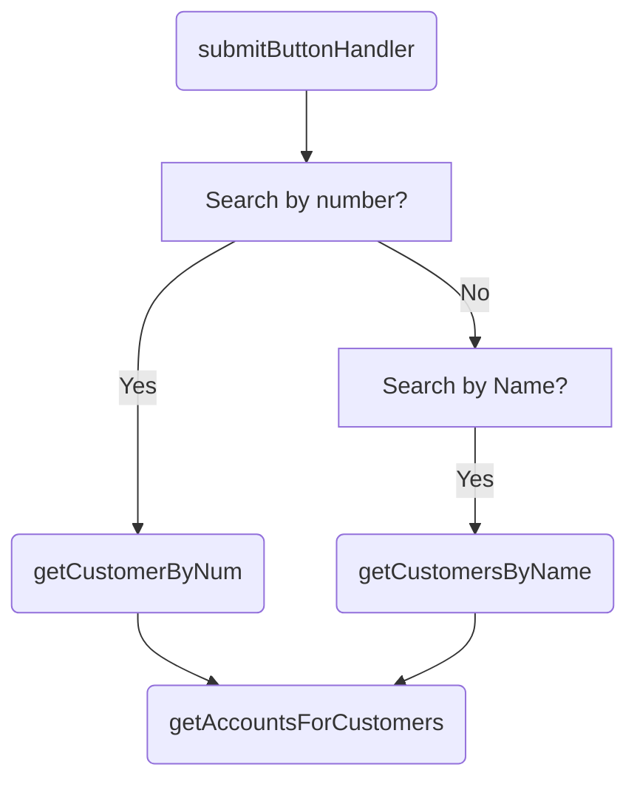

<SwmSnippet path="/src/bank-application-frontend/src/content/CustomerDetailsPage/CustomerDetailsPage.js" line="23">

---

The customer details page is a React component that displays customer information and allows the user to update the customer's details.

```javascript
const CustomerDetailsPage = () => {
  /**
   * States for table visibility and entered search values from the user
   */
  const [isOpened, setTableOpened] = useState(false);
```

---

</SwmSnippet>

## Customer Data Retrieval



<SwmSnippet path="/src/bank-application-frontend/src/content/CustomerDetailsPage/CustomerDetailsPage.js" line="47">

---

### <SwmToken path="/src/bank-application-frontend/src/content/CustomerDetailsPage/CustomerDetailsPage.js" pos="47:3:3" line-data="  function submitButtonHandler() {">`submitButtonHandler`</SwmToken>

This function handles the submission of a search query. It calls <SwmToken path="/src/bank-application-frontend/src/content/CustomerDetailsPage/CustomerDetailsPage.js" pos="51:1:1" line-data="      getCustomerByNum(searchQuery)">`getCustomerByNum`</SwmToken> for searches by customer number or <SwmToken path="/src/bank-application-frontend/src/content/CustomerDetailsPage/CustomerDetailsPage.js" pos="55:1:1" line-data="      getCustomersByName(searchQuery)">`getCustomersByName`</SwmToken> for searches by customer name.

```javascript
  function submitButtonHandler() {
    let searchQuery;
    if (numSearch !== "") {
      searchQuery = numSearch
      getCustomerByNum(searchQuery)
    }
    else if (nameSearch !== "") {
      searchQuery = nameSearch
      getCustomersByName(searchQuery)
    }
    setTableOpened(wasOpened => !wasOpened)
  }
```

---

</SwmSnippet>

<SwmSnippet path="/src/bank-application-frontend/src/content/CustomerDetailsPage/CustomerDetailsPage.js" line="75">

---

## <SwmToken path="src/bank-application-frontend/src/content/CustomerDetailsPage/CustomerDetailsPage.js" pos="75:5:5" line-data="  async function getCustomersByName(searchQuery) {">`getCustomersByName`</SwmToken>

This function retrieves customer data based on the customer's name and updates the table with the results.

```javascript
  async function getCustomersByName(searchQuery) {
    let responseData;
    let rowBuild = [];
    await axios
      .get(process.env.REACT_APP_CUSTOMER_URL + `/name?name=${searchQuery}&limit=10`)
      .then(response => {
        responseData = response.data;
        try {
          responseData.customers.forEach(customer => {
            let formattedDOB = getDay(customer.dateOfBirth) + "-" + getMonth(customer.dateOfBirth) + "-" + getYear(customer.dateOfBirth)
            let formattedReviewDate = getDay(customer.customerCreditScoreReviewDate) + "-" + getMonth(customer.customerCreditScoreReviewDate) +
            "-" + getYear(customer.customerCreditScoreReviewDate)
            let row;
            row = {
              id: parseInt(customer.id).toString(),
```

---

</SwmSnippet>

<SwmSnippet path="/src/bank-application-frontend/src/content/CustomerDetailsPage/CustomerDetailsPage.js" line="119">

---

## <SwmToken path="src/bank-application-frontend/src/content/CustomerDetailsPage/CustomerDetailsPage.js" pos="119:5:5" line-data="  async function getCustomerByNum(searchQuery) {">`getCustomerByNum`</SwmToken>

This function retrieves customer data based on the customer's number and updates the table with the results.

```javascript
  async function getCustomerByNum(searchQuery) {
    let responseData;
    let rowBuild = [];
    await axios
      .get(process.env.REACT_APP_CUSTOMER_URL + `/${searchQuery}`)
      .then(response => {
        responseData = response.data;
        try {
          let row;
          let formattedDOB = getDay(responseData.dateOfBirth) + "-" + getMonth(responseData.dateOfBirth) + "-" + getYear(responseData.dateOfBirth)
          let formattedReviewDate = getDay(responseData.customerCreditScoreReviewDate) + "-" + getMonth(responseData.customerCreditScoreReviewDate) +
            "-" + getYear(responseData.customerCreditScoreReviewDate)
          row = {
            id: parseInt(responseData.id).toString(),
            customerNumber: parseInt(responseData.id).toString(),
```

---

</SwmSnippet>

<SwmSnippet path="/src/bank-application-frontend/src/content/CustomerDetailsPage/CustomerDetailsPage.js" line="161">

---

## <SwmToken path="src/bank-application-frontend/src/content/CustomerDetailsPage/CustomerDetailsPage.js" pos="161:5:5" line-data="  async function getAccountsForCustomers(customerID) {">`getAccountsForCustomers`</SwmToken>

This function retrieves account data for a specific customer and updates the table with the results.

```javascript
  async function getAccountsForCustomers(customerID) {
    let accountData;
    let accountRowBuild = []
    await axios
      .get(process.env.REACT_APP_ACCOUNT_URL + `/retrieveByCustomerNumber/${customerID}`)
      .then(response => {
        accountData = response.data;
        let row;
        accountData.accounts.forEach(account => {
          row = {
            accountNumber: account.id,
            sortCode: account.sortCode,
            accountType: account.accountType,
            interestRate: account.interestRate,
            overdraft: account.overdraft,
            availableBalance: account.availableBalance,
            actualBalance: account.actualBalance,
            accountOpened: account.dateOpened,
            lastStatementDate: account.lastStatementDate,
```

---

</SwmSnippet>

&nbsp;

*This is an auto-generated document by Swimm AI 🌊 and has not yet been verified by a human*

<SwmMeta version="3.0.0" repo-id="Z2l0aHViJTNBJTNBY2ljcy1iYW5raW5nLXNhbXBsZS1hcHBsaWNhdGlvbi1jYnNhLUlCTS1EZW1vJTNBJTNBU3dpbW0tRGVtbw==" repo-name="cics-banking-sample-application-cbsa"><sup>Powered by [Swimm](https://staging.swimm.cloud/)</sup></SwmMeta>
