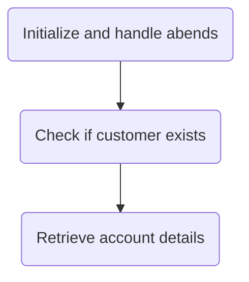
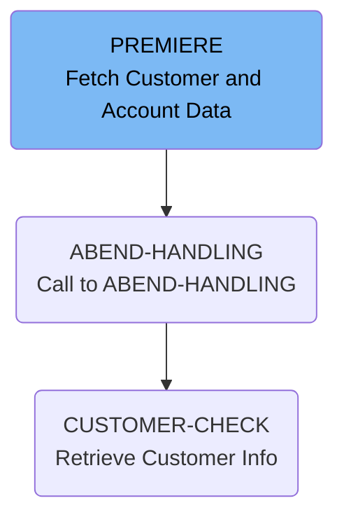
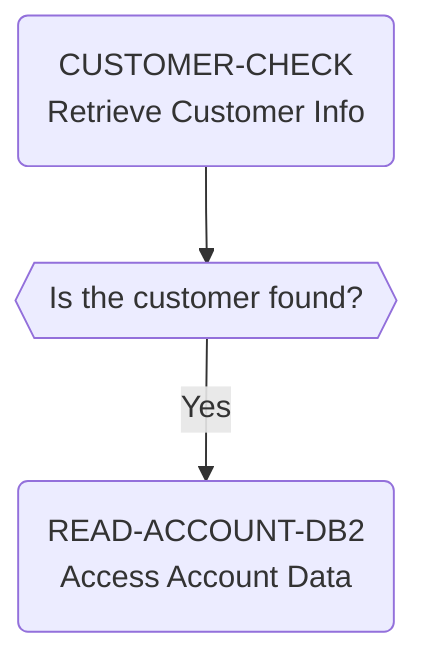

The INQACCCU program accepts a customer number as input and retrieves the associated account records that match the customer number.



# Flow drill down

First, we'll zoom into this section of the flow:



<SwmSnippet path="src/base/cobol_src/INQACCCU.cbl" line="194" repo-id="Z2l0aHViJTNBJTNBY2ljcy1iYW5raW5nLXNhbXBsZS1hcHBsaWNhdGlvbi1jYnNhLUlCTS1EZW1vJTNBJTNBU3dpbW0tRGVtbw==">

---

## PREMIERE

This is the main section, it retrieves customer and account information from a DB2 database. It first checks if the customer exists by calling <SwmToken path="/src/base/cobol_src/INQACCCU.cbl" pos="210:3:5" line-data="           PERFORM CUSTOMER-CHECK." repo-id="Z2l0aHViJTNBJTNBY2ljcy1iYW5raW5nLXNhbXBsZS1hcHBsaWNhdGlvbi1jYnNhLUlCTS1EZW1vJTNBJTNBU3dpbW0tRGVtbw==" repo-name="cics-banking-sample-application-cbsa-IBM-Demo">`CUSTOMER-CHECK`</SwmToken>, and if found, proceeds to fetch the account details for that customer using <SwmToken path="/src/base/cobol_src/INQACCCU.cbl" pos="222:3:7" line-data="           PERFORM READ-ACCOUNT-DB2" repo-id="Z2l0aHViJTNBJTNBY2ljcy1iYW5raW5nLXNhbXBsZS1hcHBsaWNhdGlvbi1jYnNhLUlCTS1EZW1vJTNBJTNBU3dpbW0tRGVtbw==" repo-name="cics-banking-sample-application-cbsa-IBM-Demo">`READ-ACCOUNT-DB2`</SwmToken>.

```
       PREMIERE SECTION.
       A010.
           MOVE 'N' TO COMM-SUCCESS
           MOVE '0' TO COMM-FAIL-CODE

           EXEC CICS HANDLE ABEND
              LABEL(ABEND-HANDLING)
           END-EXEC.

           MOVE SORTCODE TO REQUIRED-SORT-CODE OF CUSTOMER-KY.

      *
      *    CUSTOMER-CHECK LINKS to program INQCUST to retrieve the
      *    customer information.
      *

           PERFORM CUSTOMER-CHECK.
```

---

</SwmSnippet>

<SwmSnippet path="src/base/cobol_src/INQACCCU.cbl" line="688" repo-id="Z2l0aHViJTNBJTNBY2ljcy1iYW5raW5nLXNhbXBsZS1hcHBsaWNhdGlvbi1jYnNhLUlCTS1EZW1vJTNBJTNBU3dpbW0tRGVtbw==">

---

### <SwmToken path="/src/base/cobol_src/INQACCCU.cbl" pos="688:1:3" line-data="       ABEND-HANDLING SECTION." repo-id="Z2l0aHViJTNBJTNBY2ljcy1iYW5raW5nLXNhbXBsZS1hcHBsaWNhdGlvbi1jYnNhLUlCTS1EZW1vJTNBJTNBU3dpbW0tRGVtbw==" repo-name="cics-banking-sample-application-cbsa-IBM-Demo">`ABEND-HANDLING`</SwmToken>

This section handles abnormal program terminations (ABENDs) by evaluating the abnormal code and taking appropriate action.

```
       ABEND-HANDLING SECTION.
       AH010.

           EXEC CICS ASSIGN
              ABCODE(MY-ABEND-CODE)
           END-EXEC.

      *
      *    Evaluate the Abend code that is returned
      *     - For DB2 AD2Z ... provide some diagnostics.
      *     - For VSAM RLS abends: AFCR, AFCS and AFCT record the
      *       Abend as happening but do not abend ... leave this to
      *       CPSM WLM "Storm drain" (Abend probability) to handle
      *     If not a "storm drain" ... take the abend afterwards
      *
           EVALUATE MY-ABEND-CODE
```

---

</SwmSnippet>

Now, lets zoom into this section of the flow:



<SwmSnippet path="src/base/cobol_src/INQACCCU.cbl" line="829" repo-id="Z2l0aHViJTNBJTNBY2ljcy1iYW5raW5nLXNhbXBsZS1hcHBsaWNhdGlvbi1jYnNhLUlCTS1EZW1vJTNBJTNBU3dpbW0tRGVtbw==">

---

### <SwmToken path="/src/base/cobol_src/INQACCCU.cbl" pos="829:1:3" line-data="       CUSTOMER-CHECK SECTION." repo-id="Z2l0aHViJTNBJTNBY2ljcy1iYW5raW5nLXNhbXBsZS1hcHBsaWNhdGlvbi1jYnNhLUlCTS1EZW1vJTNBJTNBU3dpbW0tRGVtbw==" repo-name="cics-banking-sample-application-cbsa-IBM-Demo">`CUSTOMER-CHECK`</SwmToken>

This section retrieves customer information by linking to the INQCUST program, which queries the customer details based on the customer number provided in the communication area.

```
       CUSTOMER-CHECK SECTION.
       CC010.
      *
      *    Retrieve customer information by linking to INQCUST
      *

           IF CUSTOMER-NUMBER IN DFHCOMMAREA = ZERO
              MOVE 'N' TO CUSTOMER-FOUND
              MOVE ZERO TO NUMBER-OF-ACCOUNTS
              GO TO CC999
           END-IF.

           IF CUSTOMER-NUMBER IN DFHCOMMAREA = '9999999999'
              MOVE 'N' TO CUSTOMER-FOUND
              MOVE ZERO TO NUMBER-OF-ACCOUNTS
              GO TO CC999
           END-IF.
```

---

</SwmSnippet>

After performing <SwmToken path="/src/base/cobol_src/INQACCCU.cbl" pos="829:1:3" line-data="       CUSTOMER-CHECK SECTION." repo-id="Z2l0aHViJTNBJTNBY2ljcy1iYW5raW5nLXNhbXBsZS1hcHBsaWNhdGlvbi1jYnNhLUlCTS1EZW1vJTNBJTNBU3dpbW0tRGVtbw==" repo-name="cics-banking-sample-application-cbsa">`CUSTOMER-CHECK`</SwmToken>, in case it was successful, <SwmToken path="/src/base/cobol_src/INQACCCU.cbl" pos="194:1:1" line-data="       PREMIERE SECTION." repo-id="Z2l0aHViJTNBJTNBY2ljcy1iYW5raW5nLXNhbXBsZS1hcHBsaWNhdGlvbi1jYnNhLUlCTS1EZW1vJTNBJTNBU3dpbW0tRGVtbw==" repo-name="cics-banking-sample-application-cbsa">`PREMIERE`</SwmToken> moves on to perform <SwmToken path="/src/base/cobol_src/INQACCCU.cbl" pos="233:1:5" line-data="       READ-ACCOUNT-DB2 SECTION." repo-id="Z2l0aHViJTNBJTNBY2ljcy1iYW5raW5nLXNhbXBsZS1hcHBsaWNhdGlvbi1jYnNhLUlCTS1EZW1vJTNBJTNBU3dpbW0tRGVtbw==" repo-name="cics-banking-sample-application-cbsa">`READ-ACCOUNT-DB2`</SwmToken>.

<SwmSnippet path="/src/base/cobol_src/INQACCCU.cbl" line="233" repo-id="Z2l0aHViJTNBJTNBY2ljcy1iYW5raW5nLXNhbXBsZS1hcHBsaWNhdGlvbi1jYnNhLUlCTS1EZW1vJTNBJTNBU3dpbW0tRGVtbw==">

---

## <SwmToken path="/src/base/cobol_src/INQACCCU.cbl" pos="233:1:5" line-data="       READ-ACCOUNT-DB2 SECTION." repo-id="Z2l0aHViJTNBJTNBY2ljcy1iYW5raW5nLXNhbXBsZS1hcHBsaWNhdGlvbi1jYnNhLUlCTS1EZW1vJTNBJTNBU3dpbW0tRGVtbw==" repo-name="cics-banking-sample-application-cbsa">`READ-ACCOUNT-DB2`</SwmToken>

This section is responsible for retrieving accounts from the account datastore using the customer number and sort code from the <SwmToken path="/src/base/cobol_src/INQACCCU.cbl" pos="224:15:15" line-data="      * Return the ACCOUNT data to the COMMAREA" repo-id="Z2l0aHViJTNBJTNBY2ljcy1iYW5raW5nLXNhbXBsZS1hcHBsaWNhdGlvbi1jYnNhLUlCTS1EZW1vJTNBJTNBU3dpbW0tRGVtbw==" repo-name="cics-banking-sample-application-cbsa-IBM-Demo">`COMMAREA`</SwmToken>.

It checks if the cursor open failed. If so, the code performs error handling by performing a synpoint rollback and linking to an abend handler program.

After the cursor is opened, the code retrieves each of the accounts associated with the customer by calling <SwmToken path="/src/base/cobol_src/INQACCCU.cbl" pos="454:1:3" line-data="       FETCH-DATA SECTION." repo-id="Z2l0aHViJTNBJTNBY2ljcy1iYW5raW5nLXNhbXBsZS1hcHBsaWNhdGlvbi1jYnNhLUlCTS1EZW1vJTNBJTNBU3dpbW0tRGVtbw==" repo-name="cics-banking-sample-application-cbsa-IBM-Demo">`FETCH-DATA`</SwmToken>.&nbsp;

After retrieving the data, the code closes the cursor. If there is an error when closing the cursor, the code performs error handling again - by performing a synpoint rollback and linking to an abend handler program.

Finally, the code moves a value of <SwmToken path="/src/base/cobol_src/INQACCCU.cbl" pos="448:4:4" line-data="           MOVE &#39;Y&#39; TO COMM-SUCCESS." repo-id="Z2l0aHViJTNBJTNBY2ljcy1iYW5raW5nLXNhbXBsZS1hcHBsaWNhdGlvbi1jYnNhLUlCTS1EZW1vJTNBJTNBU3dpbW0tRGVtbw==" repo-name="cics-banking-sample-application-cbsa-IBM-Demo">`Y`</SwmToken> to the <SwmToken path="/src/base/cobol_src/INQACCCU.cbl" pos="448:9:11" line-data="           MOVE &#39;Y&#39; TO COMM-SUCCESS." repo-id="Z2l0aHViJTNBJTNBY2ljcy1iYW5raW5nLXNhbXBsZS1hcHBsaWNhdGlvbi1jYnNhLUlCTS1EZW1vJTNBJTNBU3dpbW0tRGVtbw==" repo-name="cics-banking-sample-application-cbsa-IBM-Demo">`COMM-SUCCESS`</SwmToken> field, indicating a successful communication with the database.

```cobol
       READ-ACCOUNT-DB2 SECTION.
       RAD010.
      *
      *    Get accounts from account datastore
      *

      *
      *    Open the DB2 CURSOR
      *

           MOVE CUSTOMER-NUMBER IN DFHCOMMAREA TO HV-ACCOUNT-CUST-NO.
           MOVE  SORTCODE TO HV-ACCOUNT-SORTCODE.
```

---

</SwmSnippet>

<SwmSnippet path="/src/base/cobol_src/INQACCCU.cbl" line="454" repo-id="Z2l0aHViJTNBJTNBY2ljcy1iYW5raW5nLXNhbXBsZS1hcHBsaWNhdGlvbi1jYnNhLUlCTS1EZW1vJTNBJTNBU3dpbW0tRGVtbw==">

---

### <SwmToken path="/src/base/cobol_src/INQACCCU.cbl" pos="454:1:3" line-data="       FETCH-DATA SECTION." repo-id="Z2l0aHViJTNBJTNBY2ljcy1iYW5raW5nLXNhbXBsZS1hcHBsaWNhdGlvbi1jYnNhLUlCTS1EZW1vJTNBJTNBU3dpbW0tRGVtbw==" repo-name="cics-banking-sample-application-cbsa-IBM-Demo">`FETCH-DATA`</SwmToken>&nbsp;

This section is responsible for fetching the account details from the database cursor.&nbsp;

The code starts by entering a loop that fetches data from the <SwmToken path="/src/base/cobol_src/INQACCCU.cbl" pos="466:9:11" line-data="              EXEC SQL FETCH FROM ACC-CURSOR" repo-id="Z2l0aHViJTNBJTNBY2ljcy1iYW5raW5nLXNhbXBsZS1hcHBsaWNhdGlvbi1jYnNhLUlCTS1EZW1vJTNBJTNBU3dpbW0tRGVtbw==" repo-name="cics-banking-sample-application-cbsa-IBM-Demo">`ACC-CURSOR`</SwmToken>. For each row fetched, it moves the data into the appropriate fields and increments the <SwmToken path="/src/base/cobol_src/INQACCCU.cbl" pos="583:7:11" line-data="              ADD 1 TO NUMBER-OF-ACCOUNTS GIVING NUMBER-OF-ACCOUNTS" repo-id="Z2l0aHViJTNBJTNBY2ljcy1iYW5raW5nLXNhbXBsZS1hcHBsaWNhdGlvbi1jYnNhLUlCTS1EZW1vJTNBJTNBU3dpbW0tRGVtbw==" repo-name="cics-banking-sample-application-cbsa-IBM-Demo">`NUMBER-OF-ACCOUNTS`</SwmToken> variable. The loop will fetch up to <SwmToken path="/src/base/cobol_src/INQACCCU.cbl" pos="464:9:9" line-data="           NUMBER-OF-ACCOUNTS = 20" repo-id="Z2l0aHViJTNBJTNBY2ljcy1iYW5raW5nLXNhbXBsZS1hcHBsaWNhdGlvbi1jYnNhLUlCTS1EZW1vJTNBJTNBU3dpbW0tRGVtbw==" repo-name="cics-banking-sample-application-cbsa-IBM-Demo">`20`</SwmToken> accounts per customer.

If there is an error during the fetch operation, the code performs error handling by performing a synpoint rollback and linking to an abend handler program.

```cobol
       FETCH-DATA SECTION.
       FD010.
      *
      *    Fetch each account in turn, & store data until there are no
      *    more rows to process. (There is a maximum of 20 accounts per
      *    customer).
      *
           MOVE ZERO TO NUMBER-OF-ACCOUNTS.

           PERFORM UNTIL SQLCODE NOT = 0 OR
           NUMBER-OF-ACCOUNTS = 20
```

---

</SwmSnippet>

*This is an auto-generated document by Swimm AI 🌊 and has not yet been verified by a hum*

<SwmMeta version="3.0.0"><sup>Powered by [Swimm](https://app.swimm.io/)</sup></SwmMeta>
